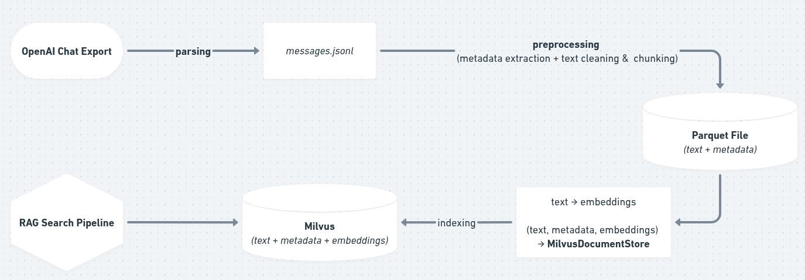

# RAG‑OpenAI‑Chats  
*Un buscador inteligente, **100 % local (hasta donde tú quieras)**, para consultar tu historial completo de ChatGPT sin regalar tus datos.*


> Exporta tus chats desde OpenAI, transfórmalos a Parquet, genera embeddings con Sentence‑Transformers, indexa en Milvus y pregúntale cualquier cosa a tu “yo del pasado” con RAG via Haystack .


## Tabla de Contenidos
1. [¿Por qué?](#por-qué-la-molestia)
2. [Estructura del Repo](#estructura-del-repo)
3. [Requisitos](#requisitos)
4. [Instalación Rápida](#instalación-rápida)
5. [Pipeline — Visión Global](#pipeline-de-alto-nivel)
6. [Uso Paso a Paso](#uso-paso-a-paso)
7. [Privacidad y Buenas Prácticas](#privacidad-y-buenas-prácticas)
8. [Roadmap](#roadmap)
9. [Contribuir](#contribuir)

---

## ¿Por qué la molestia?  
Las big‑tech monetizan nuestras conversaciones. Ahí dentro está tu memoria de trabajo, ideas de negocio, snippets de código y decisiones de proyecto. **RAG‑OpenAI‑Chats** te devuelve el control:

* **Memoria aumentada** – encuentra esa recomendación que diste hace 3 meses.  
* **Reaprovecha código** – copia/pega tu propio snippet en segundos.  
* **Audita tus ideas** – sigue la evolución de un razonamiento a lo largo del tiempo.  
* **Privado por diseño** – todo vive en tu portátil o NAS.

---

## Estructura del Repo

```bash
.
├── data/                 # ⚠️ NO versiones nada aquí (git‑ignored por defecto)
│   ├── raw/              # exportaciones originales (OpenAI, Claude, Gemini…)
│   ├── interim/          # messages.jsonl aplanado
│   └── processed/        # chunks.parquet + embeddings\_batches/
├── notebooks/            # 01‑parse‑openai.ipynb … 04‑simple‑rag.ipynb
├── scripts/              # extract\_chats.py (CLI equivalente a los notebooks)
├── src/
│   └── utils.py          # helpers comunes (chunking, limpieza, etc.)
├── docs/                 # documentación pública
└── README.md             # este fichero
```

---


## Instalación Rápida

```bash
git clone https://github.com/MrCabss69/rag-openai-chats.git
cd rag-openai-chats
python -m venv .venv && source .venv/bin/activate
pip install -r requirements.txt
```
---

## Pipeline de Alto Nivel



* **Persistencia** – Parquet para datos tabulares (sql-like), Milvus para vectores.
* **Reentrante** – todos los scripts/notebooks marcan lotes `.ok` para reanudar.
* **Modular** – sustituye el modelo de embeddings o añade un `PromptNode` sin tocar el resto.

---

## Uso Paso a Paso

1. **Exporta tus chats** desde ChatGPT (Settings → Data Controls → *Export*) y coloca el zip en `data/raw/OPENAI/`.

2. **Ingesta & ETL**

   ```bash
   # ▶ abre 02‑preprocessing.ipynb y ejecuta
   ```

3. **Embeddings + Milvus**

   ```bash
   jupyter lab notebooks/03-indexing.ipynb
   #→ crea/actualiza  rag-openai-chats/sql/milvus_v0.db
   ```

4. **Consultar**

   ```bash
   jupyter lab notebooks/04-simple-rag.ipynb
   ```

---

## Privacidad y Buenas Prácticas

* **100 % local**: por defecto todo vive en tu disco.
* **.gitignore agresivo**: `data/`, archivos `.db`, embeddings y assets quedan fuera del repo.
* **Variables de entorno**: si decides llamar a la API de OpenAI, usa `export OPENAI_API_KEY=…` y *NO* la subas jamás.

---

## Roadmap

* [ ] `streamlit app` con chat UI + citaciones.
* [ ] Soporte multi‑vendor (Claude, Gemini) vía directorios `data/raw/<vendor>/`.
* [ ] Modo *Hybrid Retrieval* (BM25 + Embeddings).
* [ ] Pruebas unitarias + CI GitHub Actions.

---

## Contribuir

PRs y *issues* son bienvenidos. Revisa `CONTRIBUTING.md` (pendiente) o abre discusión en *GitHub Discussions*.

---


> **¿Te fue útil?**
> ¡Dale ⭐ al repo y comparte tus mejoras en X [@IntrinsicalAI](https://twitter.com/IntrinsicalAI)!
